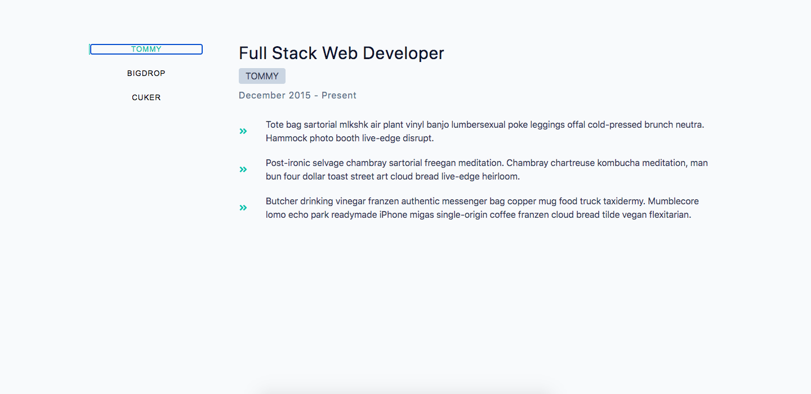

# Job Tabs



## Project Description

The `Job Tabs` project is a dynamic web application designed to showcase an individual's career journey by allowing users to navigate through their previous and current job experiences using tab functionality. 

Built with `React.js` and styled with `CSS`, this project offers a seamless and interactive way to present an individual's professional growth and accomplishments.

## Important Links

- https://job-tabbing.netlify.app/

# Setup Steps

1. [Fork and Clone](https://github.com/iamatos3/job-tabs) this repository.
2. ```npm install```
3. ```npm run dev```

### Technologies Used

- Vite
- React.js
- HTML
- CSS